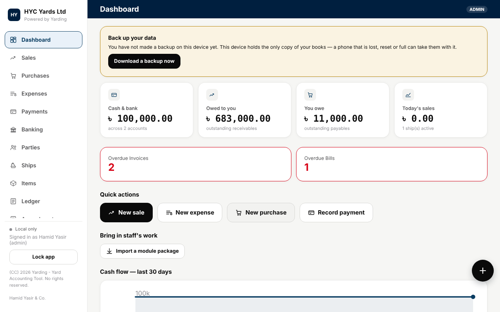
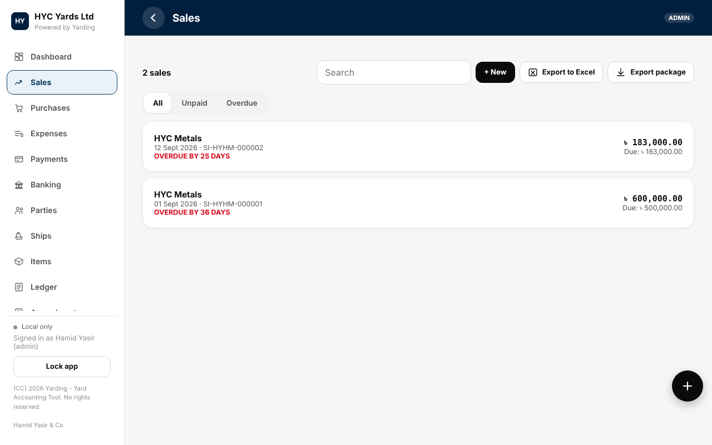
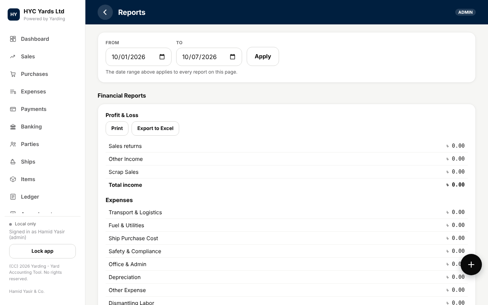
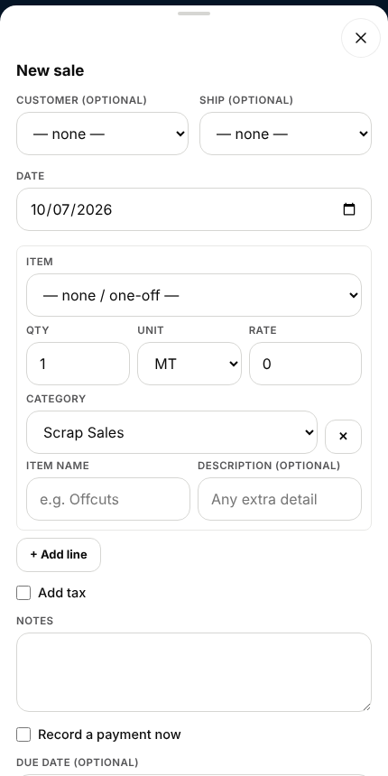
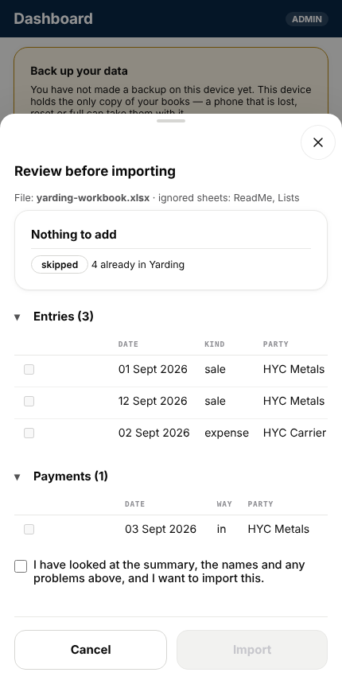
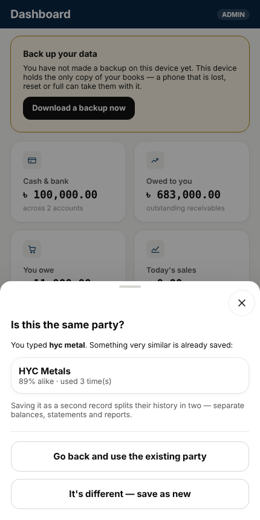

# Yarding

**Yard accounting for shipyards and ship-recycling yards. One HTML file. Works offline. Public domain.**

Yarding keeps the books for a yard that buys vessels, dismantles them, sells the scrap and pays for the work: sales, purchases, expenses, payments, a real double-entry ledger, customer and vendor statements, profit per ship, and the usual reports. It runs entirely in the browser, on a phone or a computer, with no server and no account. Your books stay on the device unless you choose to connect a cloud store.

> **Status: v0, the first public release.** It runs, it has a test suite, and it has been used in anger, but it is early. Read [KNOWN_ISSUES.md](KNOWN_ISSUES.md) (short, and honest) before you rely on it, and take a backup (Settings) before you enter real data. Accounting software should never be trusted on faith: check its figures against your own.

| | | |
|---|---|---|
|  |  |  |
|  |  |  |

(The screenshots use the app's sample data: HYC Yards Ltd, HYC Metals and so on.)

## Try it in one minute

1. Download this repository (or just `index.html`).
2. Open `index.html` in Chrome, Edge, Firefox or Safari.
3. Enter your yard's name, then your own name, and scan the QR code with an authenticator app (see [Signing in](#signing-in)).
4. Add a customer, record a sale, open Reports.

That is all. There is nothing to install and nothing to run. To use it on a phone, put `index.html` somewhere you can open it (a USB cable, a shared drive, or [GitHub Pages](docs/DEPLOYING.md)) and open it in the phone's browser.

## What it does

**Day to day**
- Sales, purchases (vendor bills) and expenses, with lines, units, tax, notes and due dates.
- Payments (including split payments), customer and vendor advances, and credit notes.
- Parties (customers and vendors) with statements, ageing, comments and running balances. A party is identified by phone number, so the same buyer typed three ways is still one buyer.
- Ships (vessels or lots) with their own purchase cost, sales and profit.
- Items with units, and printable invoices, receipts and statements with a custom template option.

**Books**
- A real double-entry ledger behind every screen: trial balance, balance sheet, profit and loss, cash flow, ageing, and a general ledger with manual journals.
- Cash and bank accounts, transfers between them, and bank reconciliation.
- Opening balances, and closing the books up to a date so finished periods cannot change.
- Chart of accounts follows ordinary double-entry practice and the vocabulary of the IFRS for SMEs standard.

**Safety**
- Every change or deletion is written to an amendment log with who, when, what changed and why.
- Multi-step operations (imports, merges, restores) happen all at once or not at all, with a snapshot taken first.
- Live backup folder (Chrome and Edge on a computer), automatic snapshots, a rollback journal for interrupted writes, JSON backups with a checksum, and an integrity check.
- Two browser windows on the same books cannot overwrite each other.

**Getting data in and out**
- Excel and CSV import and export that work offline. Download a blank template (or a workbook with your data), fill it in anywhere, and import it back. Imports are previewed, checked for duplicates and similar names, confirmed, applied as one step, and can be undone.
- A "similar names" screen finds spelling variants ("Wangtong", "Wangton") and merges them without losing history.

**People**
- Sign-in with an authenticator app, one-time backup codes and, where the browser allows, a hardware security key. The administrator sets up first and adds workers, and chooses which sections each worker can open.

**Built for phones**
- Designed mobile-first: bottom sheets with fixed Close and Back, a working back button, large touch targets, and no dependence on the internet.

## Signing in

There is no password. The first person to open the app is the administrator and sets up an authenticator: scan a QR code (or type the key) into any TOTP app, confirm a code, and save the ten backup codes. After that everyone signs in by typing the six-digit code from their own authenticator, and the app works out who they are. The administrator adds workers under **Settings, People & sign-in**.

Any TOTP app works. Open-source choices include Aegis, Ente Auth, 2FAS, FreeOTP+ and KeePassXC. Security keys (WebAuthn) are an optional extra and need the page to be served over `https://` (or `localhost`) with a real site name.

**Be clear about what sign-in is.** It controls who can use the app. It does not encrypt the data stored in the browser. Anyone with access to the device's browser storage can read it. See [SECURITY.md](SECURITY.md).

## Where your data lives

In the browser's own database (IndexedDB) on the device you use, plus a small copy of the sign-in accounts in local storage. Nothing is sent anywhere unless you connect a cloud store. If you clear the browser's storage you lose the books, so use the backup tools: a JSON backup you keep elsewhere, and on a computer the live backup folder.

## Optional cloud sync

Yarding can sync to any PostgREST-compatible store (a Supabase project or your own). Settings has the setup script. For staff on their own phones, [`server/yard-gate.js`](server/README.md) is a small proxy that keeps the database key on one machine and gives staff a pass instead. Read [SECURITY.md](SECURITY.md) first: the provided database policies are open to anyone holding the key.

## Development

```bash
npm install
npm run test:all     # syntax check, 618-check app suite, gate tests
```

Requires Node 20 or newer. The test suite runs the real file in jsdom with an in-memory IndexedDB. **jsdom does not do layout**, so it cannot catch clipped text, hidden buttons or touch problems. Check those in a real browser at 320, 360 and 390 pixels wide: `python3 tools/browser/uiaudit.py $PWD/index.html` does most of it (needs Playwright), and a person still needs to look. See [CONTRIBUTING.md](CONTRIBUTING.md).

```
index.html            the whole application (HTML, CSS and JavaScript)
tests/smoketest.js    the application test suite
server/               the optional yard gate (proxy) and its tests
tools/check.js        syntax and sanity checks for index.html
tools/browser/        real-browser layout audit (Playwright): every screen and pop-up at phone widths
docs/                 architecture, adapting, deploying, AI prompts, screenshots
KNOWN_ISSUES.md      bugs and rough edges we already know about
```

Start with [docs/ARCHITECTURE.md](docs/ARCHITECTURE.md): it is the map of the code and the list of hard-won lessons.

## Using it for a business that is not a shipyard

This repository is about shipyard accounting, and that stays its purpose. But the engine (ledger, parties, items, invoices, payments, reports, safety) is general, and a shipyard is only one set of labels, accounts and a "ship" concept on top of it. If you want a version for a workshop, a contractor, a trading company or something else, fork it and follow [docs/ADAPTING.md](docs/ADAPTING.md). If you would rather have an AI coding assistant do the work, [docs/AI_PROMPTS.md](docs/AI_PROMPTS.md) has ready-to-paste prompts.

## How it is built

Short version: the user's data must never be lost or silently changed, it must work offline on a phone, every change is recorded, and we say plainly what has and has not been verified. The longer version is in [docs/DESIGN-PHILOSOPHY.md](docs/DESIGN-PHILOSOPHY.md). Please read it before sending a large change.

## Browser support

Developed and tested in Chromium (desktop, and phone emulation with touch) and in jsdom. Firefox and Safari should work for the core app but have **not** been tested, and Safari on iPhone is where the phone-layout fixes are least verified. The live backup folder needs a Chromium desktop browser. Security keys need `https://`.

## What it is not

It is not payroll, stock control, multi-currency, multi-company or tax-filing software, and it is not a substitute for an accountant. It comes with no warranty.

## Licence

Everything in this repository that is original to Yarding is dedicated to the public domain under **CC0 1.0 Universal**. See [LICENSE](LICENSE). You can copy, change, publish and sell it without asking. The About text keeps the author's credit line (Hamid Yasir & Co.). One third-party library (the QR code generator) is embedded in `index.html` under its own MIT licence; see [THIRD_PARTY_NOTICES.md](THIRD_PARTY_NOTICES.md). CC0 does not grant patent or trademark rights.
